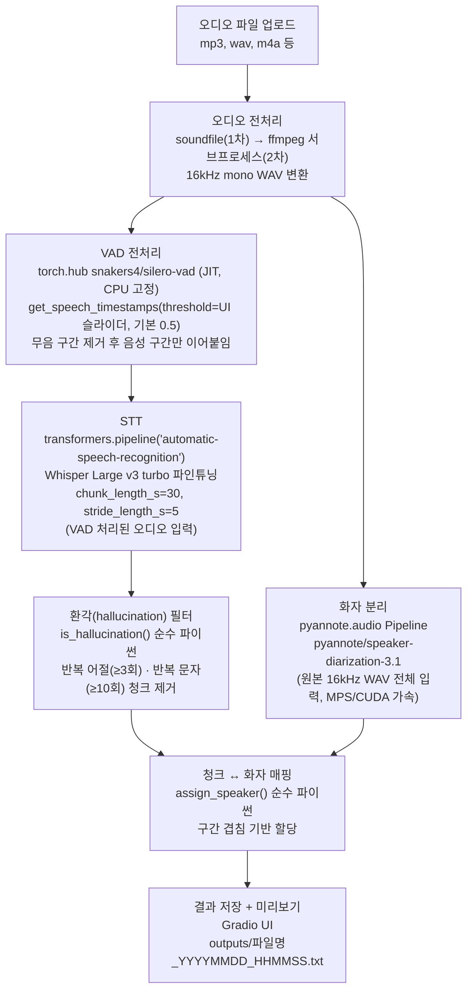

# 한국어 STT 녹취록

클로바노트처럼 음성 파일을 업로드하면 **타임스탬프 + 화자 분리**가 포함된 한국어 녹취록을 자동 생성하는 로컬 실행 앱
파일이 외부 서버로 전송되지 않으며, 최초 모델 다운로드 이후에는 인터넷 없이도 동작한다.

---

## 의의

| 항목 | 내용 |
|------|------|
| 보안 | 음성 파일이 외부로 전송되지 않음 |
| 비용 | 무료 (클라우드 STT API 불필요) |
| 기능 | 타임스탬프 + 화자 분리 — 클로바노트 결과물과 유사 |
| 플랫폼 | macOS Apple Silicon (MPS 가속) |

---

## 시스템 구조



STT는 VAD를 거친 오디오(C)를, 화자 분리는 원본 오디오(B)를 그대로 입력받음 — 이 갈라지는 지점이 아래 알려진 한계의 원인

> **알려진 한계**: STT는 VAD로 무음을 제거한 오디오 기준 타임스탬프를 쓰고, 화자 분리는 원본 오디오 전체를 기준으로 하기 때문에 두 타임라인이 정확히 일치하지 않을 수 있음, 무음 구간이 많은 오디오일수록 화자 매핑 오차가 커질 수 있음 — 개선 항목

---

## 모델 · 패키지 · 라이브러리 스택

| 레이어 | 역할 | 실제 구현체 | 비고 |
|------|------|------|------|
| STT 모델 | 음성 → 텍스트 | `o0dimplz0o/Whisper-Large-v3-turbo-STT-Zeroth-KO-v2` (HuggingFace) | Whisper large-v3-turbo를 Zeroth-Korean으로 파인튜닝 |
| STT 추론 엔진 | 모델 로딩·추론·청킹·타임스탬프 | `transformers.pipeline("automatic-speech-recognition")` | **`transformers==4.46.3` 버전 고정 필수** — 5.x대에서 30초 이상 오디오의 long-form 타임스탬프가 반복적으로 리셋되는 회귀 버그 확인됨 |
| VAD (음성 구간 감지) | 무음 구간 제거 | `torch.hub.load("snakers4/silero-vad", "silero_vad")` (JIT 모델) | GPU/MPS 그래프 퓨저 미지원 이슈로 CPU 고정 실행. 오디오 1분당 약 0.3초 수준으로 매우 가벼움 |
| 화자 분리 모델 | 화자별 발화 구간 추정 | `pyannote/speaker-diarization-3.1` (내부적으로 `pyannote/segmentation-3.0` 의존) | `pyannote-audio` 라이브러리, HuggingFace 접근 동의 필요 |
| 환각 필터 | 반복·무의미 텍스트 제거 | 자체 구현 (`is_hallucination`, 순수 파이썬) | 동일 어절 3회 이상 반복 또는 동일 문자 10회 이상 반복 시 해당 청크 폐기 |
| 오디오 I/O | 파일 읽기/쓰기, 리샘플링 | `soundfile`, `resampy` | 실패 시 `ffmpeg` 서브프로세스로 폴백 |
| ML 프레임워크 | 텐서 연산, 디바이스 가속 | `torch` (`torch.backends.mps`) | 디바이스 우선순위: CUDA → MPS(Apple Silicon) → CPU |
| 모델 로딩 최적화 | 저메모리 로딩 | `accelerate` | `low_cpu_mem_usage=True` |
| 모델 허브 | 모델 다운로드·캐시 | `huggingface_hub` | 최초 실행 시 약 3~5GB 다운로드, 이후 로컬 캐시 |
| UI | 웹 인터페이스 | `gradio` | 화자 수 입력, VAD 민감도 슬라이더, 진행률 표시 |

두 STT/화자분리 모델 모두 첫 실행 시 HuggingFace에서 자동 다운로드되며, 이후에는 로컬 캐시에서 즉시 로딩된다.

---

## 출력 형식

```
SPEAKER_00
[0:00:01 -> 0:00:05]  안녕하세요, 오늘 회의를 시작하겠습니다.
[0:00:05 -> 0:00:09]  먼저 지난주 결과를 공유드리겠습니다.

SPEAKER_01
[0:00:10 -> 0:00:14]  네, 감사합니다. 말씀하신 내용 잘 들었습니다.

SPEAKER_00
[0:00:15 -> 0:00:20]  그럼 본론으로 들어가겠습니다.
```

저장 경로: `outputs/{원본파일명}_{YYYYMMDD_HHMMSS}.txt`

---

## 사전 요건

- macOS (Apple Silicon)
- Python 3.11 이상
- ffmpeg (`brew install ffmpeg`)
- HuggingFace 계정 및 토큰 (Read 권한)
- 아래 두 모델 접근 동의 완료
  - https://huggingface.co/pyannote/speaker-diarization-3.1
  - https://huggingface.co/pyannote/segmentation-3.0

---

## 설치 및 실행

### 1. HuggingFace 토큰 설정

프로젝트 폴더에 `.env` 파일 생성:

```
HF_TOKEN=hf_xxxxxxxxxxxxxxxxxxxxxxxxxxxxxxxx
```

토큰 발급: https://huggingface.co/settings/tokens

### 2. 실행(MacOS 기준)

`run.command` 파일을 더블클릭

처음 실행 시 자동으로:
1. Python 가상환경 생성
2. 패키지 설치 (5~10분)
3. 모델 다운로드 (3~5GB, 이후 생략)
4. 브라우저에서 `http://localhost:7860` 자동 오픈

### 3. 사용법

1. 브라우저에서 오디오 파일 업로드 (mp3, wav, m4a 등)
2. 화자 수 입력 (모를 경우 0 → 자동 감지. 단, 긴 오디오는 자동 감지보다 직접 지정 권장 — 알려진 제약 참고)
3. (선택) "VAD 고급 설정"에서 민감도 조절 — 높을수록 음성만 추출, 낮을수록 노이즈도 포함 (기본 0.5)
4. **변환 시작** 클릭
5. 완료 후 미리보기 확인 및 `.txt` 파일 다운로드

---

## 성능 참고

실제 통화 녹음 3개(131초/176초/558초)로 실측한 값 (Apple Silicon, MPS):

| 오디오 길이 | VAD | STT | 화자 분리 | 합계 | 실시간 대비 |
|---|---|---|---|---|---|
| 131.2초 | 0.4초 | 10.0초 | 10.6초 | 21.0초 | 약 16% |
| 175.8초 | 0.5초 | 12.3초 | 14.3초 | 27.1초 | 약 15% |
| 557.9초 | 1.4초 | 64.2초 | 45.9초 | 111.5초 | 약 20% |

MPS 기준 오디오 길이의 약 15~20% 수준 처리 시간이 걸린다 (1시간 오디오 ≈ 9~12분). 
VAD 자체는 매우 가볍고, STT와 화자 분리가 비슷한 비중을 차지한다. 
겹침 비율이 늘어나도 처리 속도 자체는 크게 변하지 않는다 (화자 분리의 고정 비용이 지배적).

**장시간 오디오 실사용 사례** (99분 실제 회의 녹음): 앱 프로세스 시작부터 결과 파일 생성까지 총 21분 5초 소요 (약 21.3%, 위 표의 15~20% 추세와 대체로 일치 — 모델 로딩·파일 업로드 대기 시간도 일부 포함된 값)
**1시간 30분이 넘는 긴 오디오도 20분 안팎이면 결과가 나온다는 뜻으로, 처리 속도는 실사용에 충분한 수준임이 확인됐다.** (이후 버전부터는 `app.py`에 단계별 소요시간 로그가 남아 다음부터는 더 정확히 측정 가능)

→ 처리 속도 문제는 사실상 해소된 것으로 보고, 앞으로는 **음성 품질(배경소음·겹침 발화)과 화자 분리 정확도** 쪽 개선에 집중하는 것이 우선순위로 보인다 (아래 알려진 제약 참고).

**참고 (알려진 한계의 실제 사례)**: 이 99분짜리 오디오의 결과 텍스트 마지막 타임스탬프는 `1:16:26`(76분 26초)로, 원본 길이보다 약 23분 짧다. VAD가 그만큼을 무음으로 판단해 제거한 뒤 STT를 돌렸기 때문 
— 즉 결과 텍스트의 타임스탬프는 **원본 파일에서 재생 위치를 찾는 용도로 쓰면 최대 20분 이상 어긋날 수 있다.** 위 "VAD-화자분리 타임라인 불일치" 항목이 실제로 관측된 사례

---

## 알려진 제약

- **처리 속도**: 로컬 모델 특성상 클라우드 서비스보다 느림
- **겹치는 발화**: 두 화자가 동시에 말하는 구간은 한 명만 할당됨 (겹침 구간 자체를 분리 인식하지 못함)
- **VAD-화자분리 타임라인 불일치**: STT는 VAD로 무음을 제거한 오디오 기준, 화자 분리는 원본 오디오 기준으로 동작해 두 타임라인이 어긋날 수 있음 — 무음이 많은 오디오일수록 화자 매핑 오차 위험 증가
- **화자 수 자동 감지 불안정**: 긴 오디오(수 분 이상)에서 화자 수를 자동 감지하면 실제보다 화자가 과도하게 분할되는 경향 확인됨 — 화자 수를 직접 지정하는 것을 권장
- **배경 소음**: 전사 품질에 영향을 미침 (별도 노이즈 제거 없음)
- **실시간 처리 불가**: 파일 업로드 후 일괄 처리 방식
- **마이크 입력 미지원**: 파일 업로드만 지원
